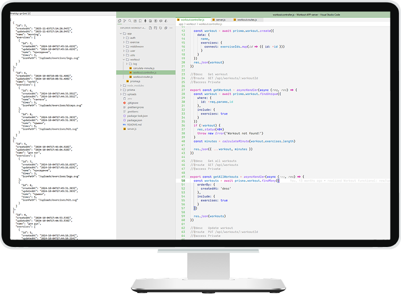

# Project name: Workout APP - backend

### 💎 Description
[](preview.png)

Backend for the "**Workout App**", built with **Express** and **Prisma**. It provides `API endpoints` for user management, workout tracking, and exercise logging. It features secure data storage, relational database support, and efficient queries for a seamless fitness experience.

### 🧩 Tech Stack


<!-- end:tech-stack -->


<details style="border:1px solid #d4d4d4; border-radius:2px; padding:1rem;">
<summary><h4 style="display:inline; padding-left:6px;">🗃 Dependencies</h4></summary>

```bash
npm install --save-dev @trivago/prettier-plugin-sort-imports
npm install -D prettier
npm i express
npm i -D colors
npm i dotenv
npm i -D morgan nodemon
npm i prisma pg
npm i express-async-handler
npm i argon2
npm i jsonwebtoken
npm i cors
```
</details>

---

<details style="border:1px solid #d4d4d4; border-radius:2px; padding:1rem;">
<summary><h3 style="display:inline; padding-left:6px;">✅ Done</h3></summary>

- [x] Async error handling for method (express-async-handler)
- [x] App.use notFound, errorHandler
- [x] generate token (jsonwebtoken)
- [x] user registration
- [x] user  login
- [x] exercise and workout models
- [x] exercise endpoint, create new exercise
- [x] update exercise
- [x] delete exercise
- [x] workout endpoint, create new workout
- [x] update workout
- [x] delete workout
- [x] workout log model
- [x] exercise log model
- [x] create endpoints for exercise log
- [x] exercise log:
  - [x] create new log
  - [x] get log (include if exist previous sets to compare)
  - [x] update log (time/set) 
  - [x] is exercise completed
- [x] create endpoints for workout log
- [x] workout log:
  - [x] create new log
  - [x] get log
  - [x] update log isCompleted 
- [x] get user statistic
 
</details>

